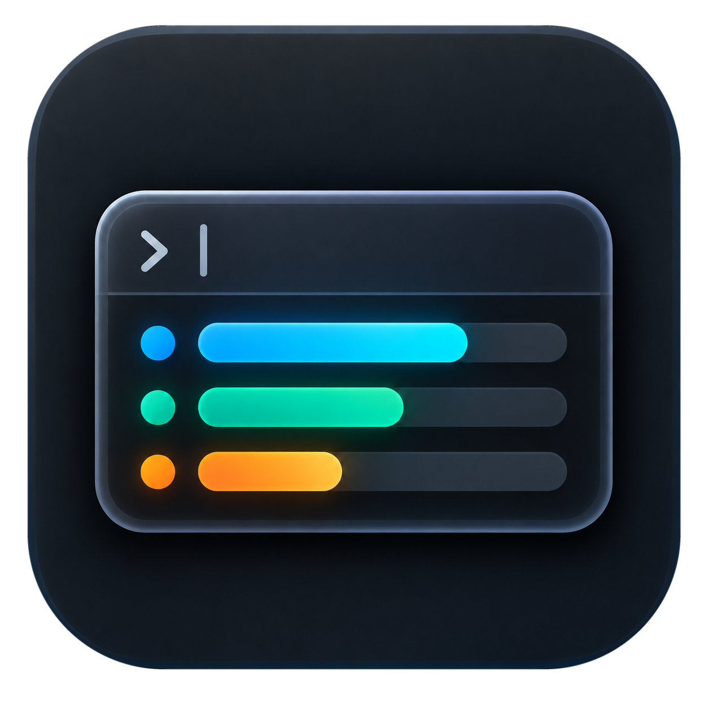
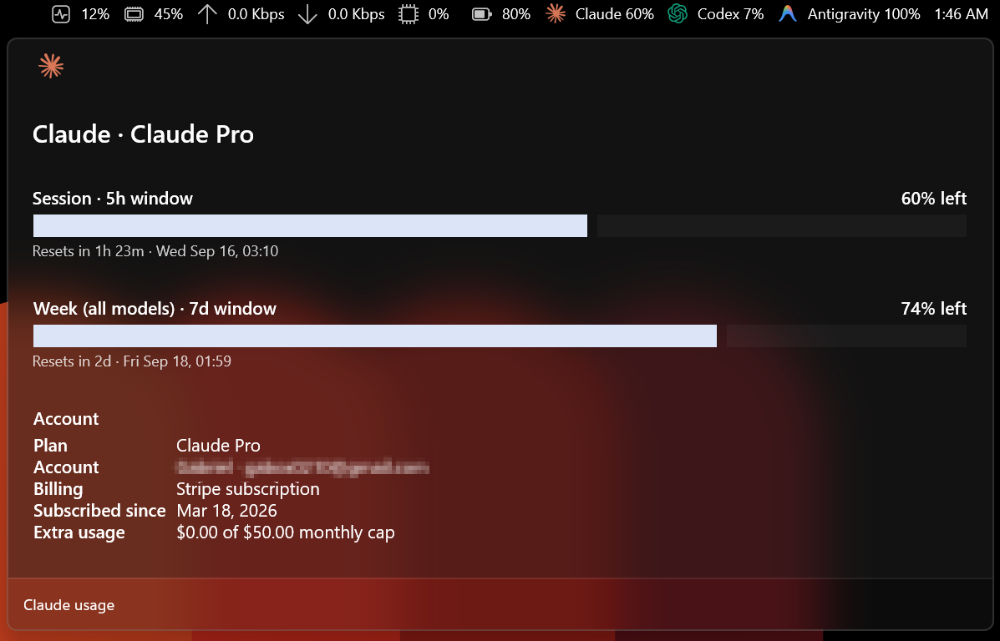
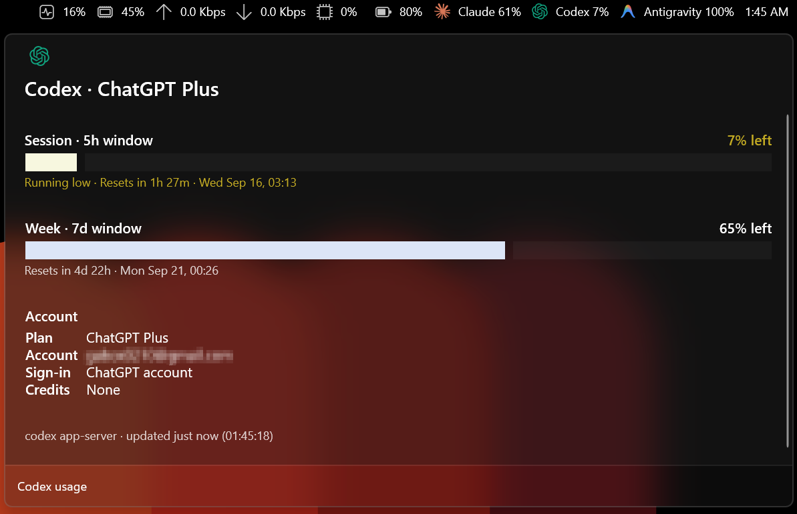
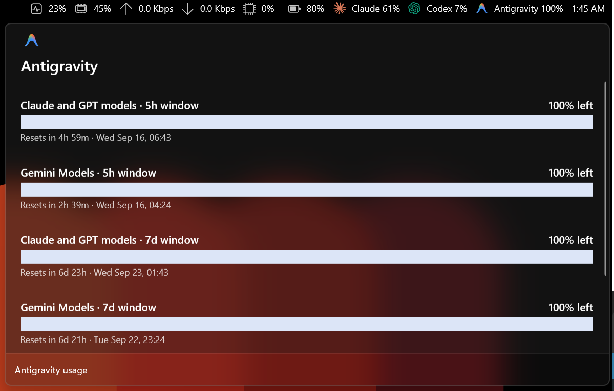

# AI Usage Dock

<p align="center">

</p>

A Windows PowerToys Command Palette extension that shows remaining Codex, Claude Code, and Antigravity subscription capacity in the Command Palette Dock.

The extension delegates authentication and usage retrieval to the installed CLIs:

- Codex: starts the native `codex app-server --stdio` executable and calls `account/read` and `account/rateLimits/read`. If the native launch or protocol fails, it retries through the installed `codex.cmd` wrapper when available.
- Claude Code: reads the service-reported `cachedUsageUtilization` snapshot and the non-secret `oauthAccount` profile maintained by Claude Code in `~/.claude.json`. When the snapshot is stale, it asks `claude -p "/usage" --output-format json` for a refresh and then rereads the cache.
- Antigravity: calls `agy -p "/usage" --mode plan --output-format json`, which returns quota data without consuming tokens, and reads the active account name from `~/.gemini/google_accounts.json`.

It never reads or stores OAuth access tokens and never calls private provider endpoints directly. The profile files it reads contain only account metadata (email, plan, organization); credentials live in separate files the extension does not open.

## Screenshots

The three bands sit on the Dock next to the built-in Performance Monitor. Selecting a band opens its detail page.



| Codex | Antigravity |
|---|---|
|  |  |

## Prerequisites

- Windows 11
- PowerToys Command Palette 0.9 or newer, with the Dock enabled
- .NET 10 SDK (`10.0.401` or a later 10.0 feature band)
- Windows 11 SDK / WinUI development tools
- Signed-in Codex, Claude Code, and/or Antigravity CLI

## Build

```powershell
./build.ps1
```

## Build and install locally

```powershell
./build-and-install.ps1
```

The install script builds and tests the extension, registers its staged package for the current user in development mode, and restarts Command Palette. It does not add a development certificate to a trust store.

## Continuous integration and releases

`.github/workflows/build.yml` builds and tests the extension on `windows-latest` for every push to `main` and every pull request, then packs a signed `AIUsageDock.msix` with `makeappx` and uploads it, together with the certificate's public half, as build artifacts.

Signing uses the `SIGNING_CERTIFICATE` repository secret, a base64 encoded PFX whose subject is `CN=AIUsageDock-Dev` so it matches the `Publisher` in `Package.appxmanifest`, with its password in `SIGNING_CERTIFICATE_PASSWORD`. Without those secrets the workflow generates a throwaway self-signed certificate, which still produces an installable package but means importing `AIUsageDock.cer` into **Local Machine → Trusted People** before Windows accepts it.

Pushing a `v*` tag, for example `v0.2.0`, stamps that version into the package identity and publishes a GitHub release carrying the `.msix` and the `.cer`.

Enabling **AI Usage Dock** in the Extensions list only enables the provider; it does not place anything on the Dock. Add the three individual bands—**Codex usage**, **Claude usage**, and **Antigravity usage**—under Command Palette **Settings → Dock → Bands**, or through **Edit Dock → +** on the Dock itself.

Use **Select subscriptions** in the extension, or its settings in Command Palette's installed extensions list, to turn off services you do not use. Disabled services are hidden from the extension's commands and available Dock bands and are not refreshed. All three are enabled by default; your choices are saved locally.

Place the AI usage bands **after** the built-in **Performance Monitor** band (CPU, memory, network, GPU). Extension bands load a moment after the built-ins, and Command Palette 0.100 rebuilds every band that follows a late insertion; the Performance Monitor widget loses its sampler when that happens and freezes at 0%. With the AI usage bands positioned after it, both keep updating.

## Detail pages

Selecting a band opens a detail page for that provider. Each page shows:

- One section per limit window with a filled remaining-capacity bar, the window length (`5h`, `7d`), a countdown to the reset and the local reset time. The bar takes the theme accent colour, turns amber under 20%, and red when a window is exhausted or locked.
- An **Account** block with whatever the CLI reports about the subscription:
  - Claude: plan (Pro, Max, Team, Enterprise), account, organization and role for team plans, billing type, subscription date, rate-limit tier when it is not the default, and extra-usage spend against the monthly cap. Per-model weekly caps (Opus, Sonnet) appear as their own windows when the service reports them.
  - Codex: ChatGPT plan, account email, sign-in method, and credit balance.
  - Antigravity: active Google account, plus a plan or tier if a future CLI adds one to the quota payload.
- A footer with the data source and how long ago it was read.

The page is an Adaptive Card rendered by Command Palette, so it follows the palette theme.

When a provider cannot be read, the page names the cause (CLI missing, not signed in, timed out, no usage data) and says what to do about it.

## Usage behavior

- Percentages are displayed as remaining capacity: `100%` is full and drains toward `0%`.
- Missing windows are shown as unavailable rather than estimated.
- A still-active cached Claude snapshot can be shown as stale if a live refresh fails.
- Expired cached limits are never presented as current.
- Automatic refreshes are throttled and concurrent refreshes are coalesced.
- If `ANTHROPIC_API_KEY` is set, the extension will not launch a Claude subscription refresh command; it will use only the existing cache to avoid silently switching billing modes.

## Project layout

```text
AIUsageDock/
  Bands/       Dock presentation
  Models/      Shared usage model
  Pages/       Command Palette detail pages
  Providers/   Claude, Codex, and Antigravity CLI adapters
AIUsageDock.Tests/
  Provider parser regression tests
```

See [THIRD_PARTY_NOTICES.md](THIRD_PARTY_NOTICES.md) for projects consulted while designing the extension.

## About

AIUsageDock by Gabriel Chavez - Developed in Mexico with love
